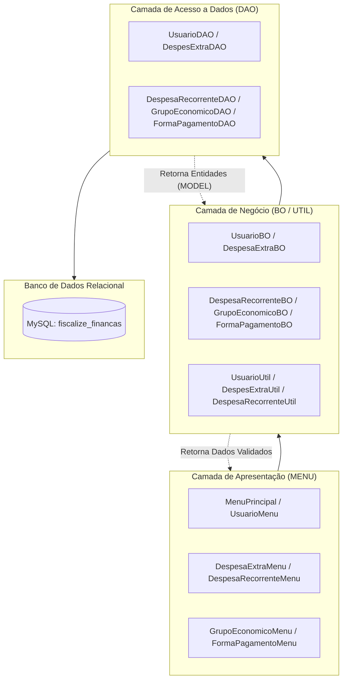
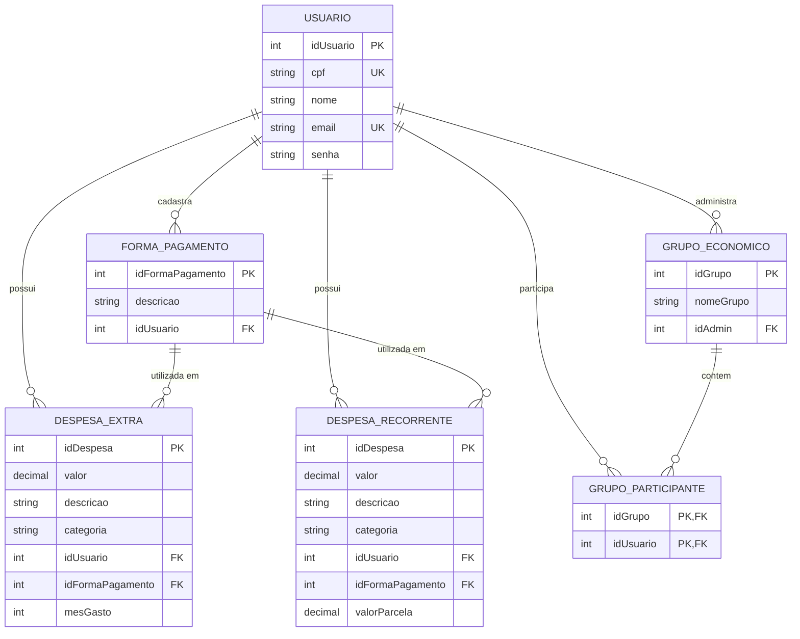

# 💰 Fiscalize Finanças - Sistema Financeiro Pessoal & Compartilhado

<p align="center">
  
  
  
</p>

<p align="center">
  <b>Sistema de Gestão Financeira robusto, modular e colaborativo desenvolvido em Java com Programação Orientada a Objetos (POO) e persistência MySQL.</b>
</p>

<p align="center">
  <a href="https://www.oracle.com/java/technologies/javase/jdk21-archive-downloads.html"></a>
  <a href="https://maven.apache.org/"></a>
  <a href="https://www.mysql.com/"></a>
  <a href="https://junit.org/junit5/"></a>
  
  
</p>

---

## 📑 Sumário

- [Visão Geral](#-visão-geral)
- [Destaques e Funcionalidades](#-destaques-e-funcionalidades)
- [Pilares de POO Aplicados](#-pilares-de-poo-aplicados)
- [Arquitetura do Software](#-arquitetura-do-software)
- [Modelo do Banco de Dados](#-modelo-do-banco-de-dados)
  - [Diagrama Entidade-Relacionamento (DER)](#diagrama-entidade-relacionamento-der)
  - [Script DDL (MySQL)](#script-ddl-mysql)
- [Estrutura do Projeto](#-estrutura-do-projeto)
- [Pré-requisitos e Instalação](#-pré-requisitos-e-instalação)
  - [1. Configurar o Banco de Dados](#1-configurar-o-banco-de-dados)
  - [2. Configurar a Conexão](#2-configurar-a-conexão)
  - [3. Executar o Projeto](#3-executar-o-projeto)
- [Guia de Navegação do Sistema](#-guia-de-navegação-do-sistema)
- [Boas Práticas & Validações Implementadas](#-boas-práticas--validações-implementadas)
- [Licença](#-licença)

---

## 🌟 Visão Geral

O **Fiscalize Finanças** é uma aplicação completa de gestão financeira desenvolvida para solucionar o controle de despesas individuais e coletivas. O projeto combina conceitos avançados de **Programação Orientada a Objetos**, **separação estrita em camadas de responsabilidade (BO, DAO, MODEL, MENU, UTIL)** e comunicação com banco de dados relacional via **JDBC (Java Database Connectivity)**.

Diferente de sistemas convencionais, o **Fiscalize Finanças** conta com o recurso inovador de **Grupos Econômicos**, permitindo que famílias, casais ou repúblicas agrupem suas contas e visualizem o impacto conjunto de suas despesas em tempo real.

---

## 🚀 Destaques e Funcionalidades

### 👤 1. Gestão de Usuários & Autenticação
- Cadastro completo com validação de CPF (11 dígitos) e e-mail único.
- Sistema de autenticação de sessão interativa.
- Edição de perfil e gerenciamento de conta com integridade referencial.

### 💸 2. Despesas Extras (Esporádicas)
- Registro de gastos pontuais categorizados (ex: alimentação, lazer, manutenção).
- Associação obrigatória à forma de pagamento pré-cadastrada.
- Registro e filtro por mês de competência (1 a 12).
- Consolidação e cálculo do somatório de gastos extras.

### 🔄 3. Despesas Recorrentes (Contas Fixas & Parcelamentos)
- Especialização de despesa para controle de parcelas ou despesas contínuas (ex: aluguel, assinaturas, financiamentos).
- Cálculo e acompanhamento de parcelas ativas.
- Totalizador de compromissos recorrentes mensais.

### 💳 4. Gestão de Formas de Pagamento
- Customização livre das opções de pagamento por usuário (ex: *Cartão Nubank*, *Pix*, *Vale Refeição*, *Dinheiro*).
- Validação para impedir criação de despesas sem método de pagamento válido associado.

### 👥 5. Grupos Econômicos (Finanças Coletivas)
- Criação e administração de grupos compartilhados.
- Adição e remoção controlada de participantes.
- Relatório consolidado de despesas de todos os integrantes do grupo.
- Exibição de totais coletivos com indicação detalhada do responsável por cada desembolso.

---

## 🏛️ Pilares de POO Aplicados

O sistema foi rigorosamente desenhado com base nos princípios de **Programação Orientada a Objetos**:

| Pilar | Aplicação Prática no Projeto |
| :--- | :--- |
| **Abstração** | Representação fiel de conceitos do domínio financeiro (`Usuario`, `Despesa`, `FormaPagamento`, `GrupoEconomico`), isolando detalhes técnicos de armazenamento das regras de negócio. |
| **Encapsulamento** | Todos os atributos das classes de modelo são `private`, acessados e alterados exclusivamente via construtores parametrizados e métodos *getters* e *setters*. |
| **Herança** | A classe base `Despesa` estende seu comportamento e atributos comuns para `DespesaExtra` (agrega `mesGasto`) e `DespesaRecorrente` (agrega `valorParcela`), reaproveitando código e garantindo consistência. |
| **Polimorfismo** | Manipulação uniforme de despesas em relatórios de grupos econômicos, permitindo tratar subtipos de despesas sob uma mesma interface comum. |
| **Composição** | A classe `GrupoEconomico` compõe coleções de instâncias de `Usuario`, assim como o `Usuario` agrega listas de `DespesaExtra` e `DespesaRecorrente`. |

---

## 📐 Arquitetura do Software

A aplicação utiliza uma arquitetura em camadas bem definida, garantindo desacoplamento, testabilidade e manutenibilidade:



- **`MODEL`**: Entidades de domínio que trafegam entre as camadas contendo estado e comportamento básico.
- **`MENU`**: Controladores de fluxo e interface CLI baseados em `Scanner`, responsáveis pela interação com o usuário.
- **`BO` (Business Object)**: Regras de negócio, consistência lógica, validações e orquestração.
- **`DAO` (Data Access Object)**: Execução de queries e comandos SQL seguros utilizando `PreparedStatement`.
- **`util`**: Gerenciamento de conexões com o banco (`conexao.java`) e regras auxiliares de validação de dados.

---

## 🗄️ Modelo do Banco de Dados

### Diagrama Entidade-Relacionamento (DER)



### Script DDL (MySQL)

Execute o script SQL abaixo no seu MySQL Server para provisionar a base de dados, criar o usuário da aplicação e todas as tabelas necessárias:

```sql
-- 1. Criação da base de dados
CREATE DATABASE IF NOT EXISTS fiscalize_financas
  DEFAULT CHARACTER SET utf8mb4
  COLLATE utf8mb4_unicode_ci;

USE fiscalize_financas;

-- 2. Criação do usuário da aplicação e concessão de privilégios
CREATE USER IF NOT EXISTS 'fiscalize_app'@'%' IDENTIFIED BY 'fiscalize@2026';
CREATE USER IF NOT EXISTS 'fiscalize_app'@'127.0.0.1' IDENTIFIED BY 'fiscalize@2026';
CREATE USER IF NOT EXISTS 'fiscalize_app'@'localhost' IDENTIFIED BY 'fiscalize@2026';

GRANT ALL PRIVILEGES ON fiscalize_financas.* TO 'fiscalize_app'@'%';
GRANT ALL PRIVILEGES ON fiscalize_financas.* TO 'fiscalize_app'@'127.0.0.1';
GRANT ALL PRIVILEGES ON fiscalize_financas.* TO 'fiscalize_app'@'localhost';
FLUSH PRIVILEGES;

-- 3. Tabela de Usuários
CREATE TABLE IF NOT EXISTS USUARIO (
    idUsuario INT AUTO_INCREMENT PRIMARY KEY,
    cpf VARCHAR(14) NOT NULL UNIQUE,
    nome VARCHAR(100) NOT NULL,
    email VARCHAR(100) NOT NULL UNIQUE,
    senha VARCHAR(255) NOT NULL
);

-- 4. Tabela de Formas de Pagamento
CREATE TABLE IF NOT EXISTS FORMA_PAGAMENTO (
    idFormaPagamento INT AUTO_INCREMENT PRIMARY KEY,
    descricao VARCHAR(100) NOT NULL,
    idUsuario INT NOT NULL,
    CONSTRAINT fk_forma_usuario FOREIGN KEY (idUsuario) REFERENCES USUARIO(idUsuario) ON DELETE CASCADE
);

-- 5. Tabela de Despesas Extras
CREATE TABLE IF NOT EXISTS DESPESA_EXTRA (
    idDespesa INT AUTO_INCREMENT PRIMARY KEY,
    valor DECIMAL(10,2) NOT NULL,
    descricao VARCHAR(255) NOT NULL,
    categoria VARCHAR(100) NOT NULL,
    idUsuario INT NOT NULL,
    idFormaPagamento INT,
    mesGasto INT NOT NULL,
    CONSTRAINT fk_extra_usuario FOREIGN KEY (idUsuario) REFERENCES USUARIO(idUsuario) ON DELETE CASCADE,
    CONSTRAINT fk_extra_pagamento FOREIGN KEY (idFormaPagamento) REFERENCES FORMA_PAGAMENTO(idFormaPagamento) ON DELETE SET NULL
);

-- 6. Tabela de Despesas Recorrentes
CREATE TABLE IF NOT EXISTS DESPESA_RECORRENTE (
    idDespesa INT AUTO_INCREMENT PRIMARY KEY,
    valor DECIMAL(10,2) NOT NULL,
    descricao VARCHAR(255) NOT NULL,
    categoria VARCHAR(100) NOT NULL,
    idUsuario INT NOT NULL,
    idFormaPagamento INT,
    valorParcela DECIMAL(10,2),
    CONSTRAINT fk_recorrente_usuario FOREIGN KEY (idUsuario) REFERENCES USUARIO(idUsuario) ON DELETE CASCADE,
    CONSTRAINT fk_recorrente_pagamento FOREIGN KEY (idFormaPagamento) REFERENCES FORMA_PAGAMENTO(idFormaPagamento) ON DELETE SET NULL
);

-- 7. Tabela de Grupos Econômicos
CREATE TABLE IF NOT EXISTS GRUPO_ECONOMICO (
    idGrupo INT AUTO_INCREMENT PRIMARY KEY,
    nomeGrupo VARCHAR(100) NOT NULL,
    idAdmin INT NOT NULL,
    CONSTRAINT fk_grupo_admin FOREIGN KEY (idAdmin) REFERENCES USUARIO(idUsuario) ON DELETE CASCADE
);

-- 8. Tabela de Associação: Participantes do Grupo
CREATE TABLE IF NOT EXISTS GRUPO_PARTICIPANTE (
    idGrupo INT NOT NULL,
    idUsuario INT NOT NULL,
    PRIMARY KEY (idGrupo, idUsuario),
    CONSTRAINT fk_gp_grupo FOREIGN KEY (idGrupo) REFERENCES GRUPO_ECONOMICO(idGrupo) ON DELETE CASCADE,
    CONSTRAINT fk_gp_usuario FOREIGN KEY (idUsuario) REFERENCES USUARIO(idUsuario) ON DELETE CASCADE
);

-- 9. View Unificada de Despesas (utilizada pelo Grupo Econômico)
CREATE OR REPLACE VIEW DESPESA AS
SELECT idDespesa, valor, descricao, categoria, idUsuario, idFormaPagamento FROM DESPESA_EXTRA
UNION ALL
SELECT idDespesa, valor, descricao, categoria, idUsuario, idFormaPagamento FROM DESPESA_RECORRENTE;
```

---

## 📂 Estrutura do Projeto

```text
SistemaFinanceiro/
├── pom.xml                                      # Gerenciador de dependências Maven
├── rodar.bat                                    # Script de inicialização rápida para Windows
├── README.md                                    # Documentação completa do sistema
└── src/
    └── main/
        └── java/
            └── com/
                └── mycompany/
                    └── sistemafinanceiro/
                        ├── SistemaFinanceiro.java       # Ponto de entrada da aplicação (main)
                        │
                        ├── BO/                          # Regras de Negócio (Business Objects)
                        │   ├── DespesaExtraBO.java
                        │   ├── DespesaRecorrenteBO.java
                        │   ├── FormaPagamentoBO.java
                        │   ├── GrupoEconomicoBO.java
                        │   └── UsuarioBO.java
                        │
                        ├── DAO/                         # Acesso a Dados (Data Access Objects)
                        │   ├── DespesExtraDAO.java
                        │   ├── DespesaRecorrenteDAO.java
                        │   ├── FormaPagamentoDAO.java
                        │   ├── GrupoEconomicoDAO.java
                        │   └── UsuarioDAO.java
                        │
                        ├── MENU/                        # Interface em Linha de Comando (CLI Views)
                        │   ├── DespesaExtraMenu.java
                        │   ├── DespesaRecorrenteMenu.java
                        │   ├── FormaPagamentoMenu.java
                        │   ├── GrupoEconomicoMenu.java
                        │   ├── MenuPrincipal.java
                        │   └── UsuarioMenu.java
                        │
                        ├── MODEL/                       # Entidades e Modelos do Domínio (POO)
                        │   ├── Despesa.java             # Superclasse base
                        │   ├── DespesaExtra.java        # Subclasse especializada
                        │   ├── DespesaRecorrente.java   # Subclasse especializada
                        │   ├── FormaPagamento.java
                        │   ├── GrupoEconomico.java
                        │   └── Usuario.java
                        │
                        └── util/                        # Utilitários e Conexão JDBC
                            ├── conexao.java             # Gerenciador de conexão com MySQL
                            ├── DespesExtraUtil.java
                            ├── DespesaRecorrenteUtil.java
                            └── UsuarioUtil.java
```

---

## ⚙️ Pré-requisitos e Instalação

### Softwares Necessários
- **Java Development Kit (JDK)** versão 21 ou superior.
- **MySQL Server** versão 8.0 ou superior em execução.
- **Apache Maven** versão 3.8+ (opcional se executado via IDE).

---

### 1. Configurar o Banco de Dados

1. Certifique-se de que o serviço do MySQL está em execução na porta padrão `3306`.
2. Abra o terminal ou seu cliente SQL preferido (MySQL Workbench, DBeaver, etc.).
3. Execute o [Script DDL (MySQL)](#script-ddl-mysql) disponibilizado nesta documentação.

---

### 2. Configurar a Conexão

As credenciais padrão de conexão estão definidas no arquivo `com.mycompany.sistemafinanceiro.util.conexao`:

```java
String url = "jdbc:mysql://127.0.0.1:3306/fiscalize_financas";
String usuario = "fiscalize_app";
String pass = "fiscalize@2026";
```

> [!TIP]
> Caso utilize outro usuário, porta ou senha no seu banco local, basta atualizar as variáveis correspondentes em `conexao.java`.

---

### 3. Executar o Projeto

#### Opção A: Via Terminal com Maven (Recomendado)

Compile e inicie a aplicação com um único comando na raiz do projeto:

```bash
mvn clean compile exec:java
```

#### Opção B: Via Script Batch (Windows)

Dê um duplo clique no arquivo `rodar.bat` ou execute no PowerShell/CMD:

```cmd
.\rodar.bat
```

#### Opção C: Via IDE (NetBeans / VS Code / IntelliJ IDEA)

1. Abra a pasta `SistemaFinanceiro` na IDE como um projeto Maven.
2. Aguarde o download das dependências declaradas no `pom.xml`.
3. Execute a classe principal `com.mycompany.sistemafinanceiro.SistemaFinanceiro`.

---

## 🧭 Guia de Navegação do Sistema

### 1. Tela Inicial
```text
=============== FISCALIZE FINANCAS ===============

ESCOLHA UMA OPCAO PARA CONTINUAR:
1 - REALIZAR LOGIN
2 - CADASTRAR USUARIO
0 - SAIR
```

### 2. Menu Principal (Após Autenticação)
```text
ESCOLHA UMA OPCAO:
1 - ACESSAR MENU DESPESA EXTRA
2 - ACESSAR MENU DESPESA RECORRENTE
3 - ACESSAR MENU GRUPO ECONOMICO
4 - ACESSAR MENU FORMA DE PAGAMENTO
5 - EDITAR PERFIL
6 - SAIR DO SISTEMA
```

### 3. Fluxo Recomendado para Primeiro Uso
1. **Cadastrar-se** na opção `2` da tela inicial e realizar login na opção `1`.
2. Acessar o menu **4 - FORMA DE PAGAMENTO** e cadastrar ao menos uma forma (ex: *Cartão de Crédito*, *Dinheiro*).
3. Acessar o menu **1 - DESPESA EXTRA** ou **2 - DESPESA RECORRENTE** para registrar lançamentos.
4. Criar um **GRUPO ECONOMICO** (menu `3`), convidar outros usuários pelo ID e acompanhar o total compartilhado!

---

## 🛡️ Boas Práticas & Validações Implementadas

- **Validação de Entrada**: Tratamento defensivo contra entradas inválidas via `InputMismatchException` no console, prevenindo travamentos ou quebras de loop.
- **Prevenção de SQL Injection**: Uso sistemático de `PreparedStatement` com queries parametrizadas em todos os DAOs.
- **Gerenciamento de Recursos**: Utilização de blocos `try-with-resources` para fechamento automático de `Connection`, `PreparedStatement` e `ResultSet`.
- **Integridade Referencial**: Uso de chaves estrangeiras com regras de cascata adequadas (`ON DELETE CASCADE` e `ON DELETE SET NULL`) para manter o banco íntegro.
- **Regras de Negócio Isoladas**: As classes de `BO` concentram as regras de integridade (ex: CPF com 11 dígitos, meses válidos entre 1 e 12, valor não negativo, e-mails não duplicados).

---

## 📄 Licença

Este projeto foi desenvolvido como trabalho prático da disciplina de **Programação Orientada a Objetos (POO)** e está disponibilizado sob a licença [MIT](LICENSE).

<p align="center">
  Desenvolvido com ☕ e dedicação à excelência em Engenharia de Software.
</p>
